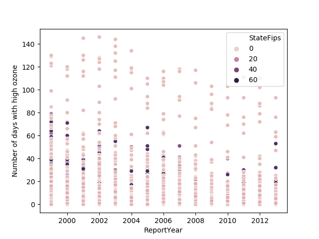
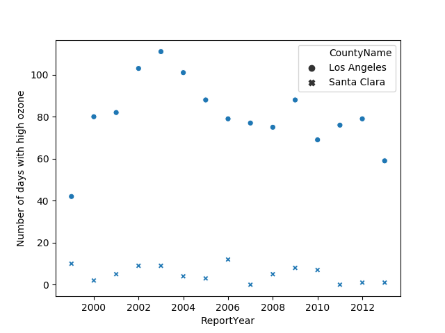

A visual look at data to get an immediate picture.  

High Ozone

 

State FIPS is a unique identifier for each state. 

Immediate conclusions:
Most places see less than 3 months with high ozone.  Number of days with high ozone is on a slow decline from late 90s to 2013.  

Disadvantages:  A simple visual presents limited information.  The data set contains information which can be more efficiently captured by a better visual design.  

Questions:
Which states have high ozone? 
Do the same states have high ozone year to year?
Is there a correlation between high ozone and other air quality measures? 

 

A comparison between the number of days with high ozone in two US counties, Los Angeles, CA, and Santa Clara, CA, shows air quality is consistently worse in LA if ozone content is used as a metric. 

URL for source of data:  https://catalog.data.gov/dataset/air-quality-measures-on-the-national-environmental-health-tracking-network

Python related comments:

Seaborn library is used to make scatter plots.  
