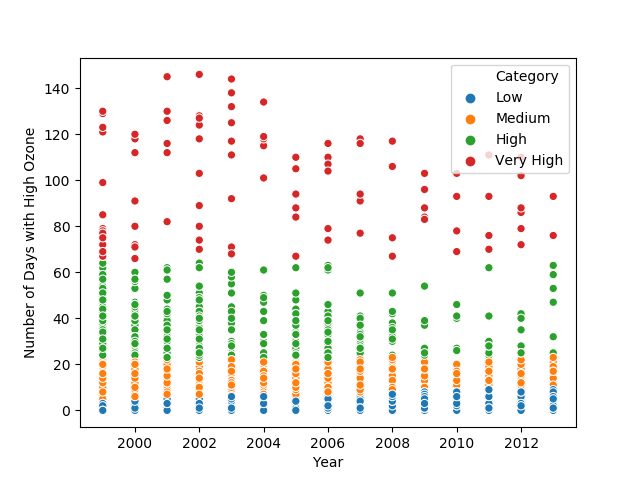
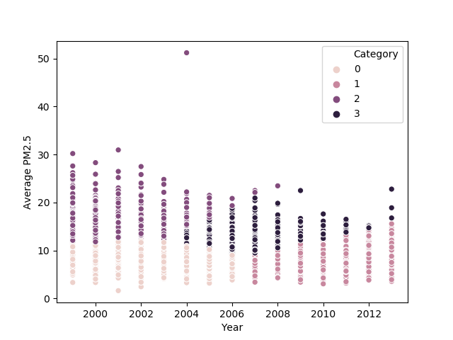
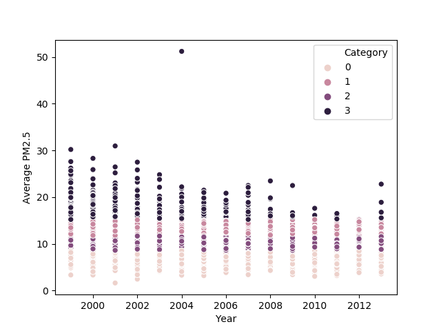

Use K-means clustering to generate warning for air pollution

Problem:  Can we use K-means clustering to generate categories of low, medium, high, and very high ozone levels

Method:  K-means clustering, 4 centers 

Data set: Number of days with high ozone, year

Problem:  Can we use K-means clustering to generate categories of low, medium, high, and very high PM2.5 particle pollution levels

Method:  K-means clustering, 4 centers 

Data set1: Particle concentration, year

Predicted clusters do now work for classifying pollution level.  So we try again by removing 1 feature, year.  

Data set2: Particle concentration

