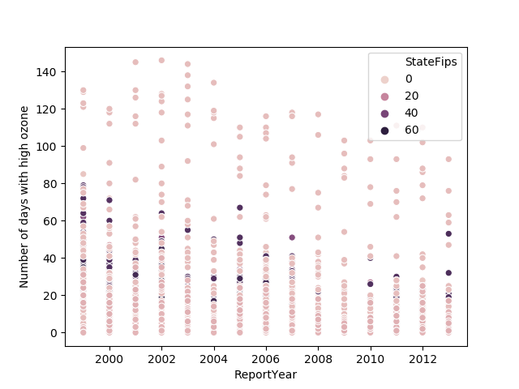
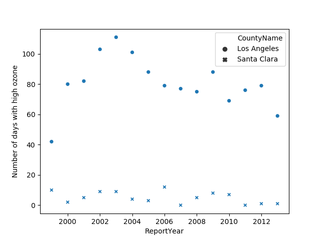

# Data
Data.gov provides large data sets to better understand the world we live in.  Here is some discussion on the data for air quality.  

High Ozone

 

State FIPS is a unique identifier for each state
Seaborn library is used to make a scatter plot

Few immediate conclusions:
Most places see less than 3 months with high ozone
In most places, number of days with high ozone is on a slow decline from late 90s to 2013
A simple visual presents limited information
The data set contains information which can be more efficiently captured by a better visual design

Questions:
Which states have high ozone?
Do the same states have high ozone year to year?
Is there a correlation between high ozone and other air quality measures? 

 

A comparison between the number of days with high ozone in two US counties, Los Angeles, CA, and Santa Clara, CA, shows air quality is consistently worse in LA if ozone content is used as a metric

URL for source of data:  https://catalog.data.gov/dataset/air-quality-measures-on-the-national-environmental-health-tracking-network
